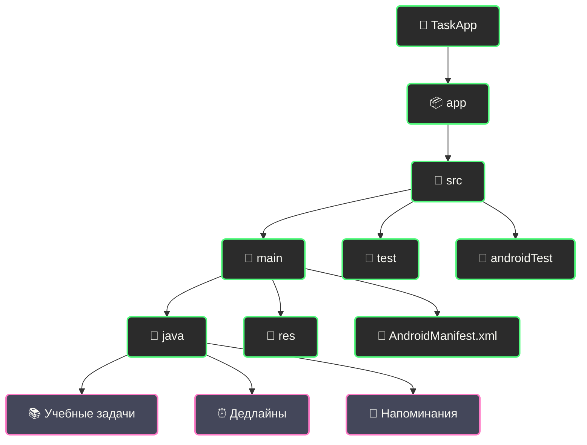

# 📚 TaskApp - Трекер учебных задач

  
  
  

  
  
  

<!-- ⚔️ ДЕКОРАТИВНЫЙ РАЗДЕЛИТЕЛЬ ⚔️ -->

  

## 🎓 Никаких пропущенных дедлайнов. Никаких академических задолженностей.

## 📋 О проекте

<h3><i>Успевай всё вовремя!</i></h3>

TaskApp - это специализированное приложение для студентов, которое помогает эффективно отслеживать учебные задания, дедлайны и академические долги. Разработанное с учетом реальных потребностей учащихся, оно помогает организовать учебный процесс и никогда не пропускать важные даты сдачи работ.

<!-- 🎯 ДЕКОРАТИВНЫЙ РАЗДЕЛИТЕЛЬ 🎯 -->

  

### ✨ Основные возможности

<table style="min-width: 300px; width: auto; max-width: 100%; overflow-x: auto; display: block;">
  <tr>
    <th align="center">📝 Функция</th>
    <th align="center">📚 Описание</th>
  </tr>
  <tr>
    <td align="center"><b>⏰ Отслеживание дедлайнов</b></td>
    <td>Визуальный календарь с подсветкой приближающихся дат сдачи работ</td>
  </tr>
  <tr>
    <td align="center"><b>📋 Учебные задания</b></td>
    <td>Организация по предметам, курсам и семестрам</td>
  </tr>
  <tr>
    <td align="center"><b>🔔 Умные напоминания</b></td>
    <td>Настраиваемые уведомления о приближающихся дедлайнах</td>
  </tr>
  <tr>
    <td align="center"><b>🎯 Приоритеты</b></td>
    <td>Выделение наиболее важных заданий и срочных работ</td>
  </tr>
  <tr>
    <td align="center"><b>📊 Прогресс обучения</b></td>
    <td>Отслеживание успеваемости и выполненных работ</td>
  </tr>
  <tr>
    <td align="center"><b>📱 Быстрый доступ</b></td>
    <td>Виджеты с ближайшими дедлайнами на главном экране</td>
  </tr>
</table>

<!-- 🔥 ДЕКОРАТИВНЫЙ РАЗДЕЛИТЕЛЬ 🔥 -->

  

## 🚀 Технологический стек

<b>⚡ Используемые технологии</b>

 

| 💻 Технология | 📝 Описание |
|---------------|-------------|
| Kotlin | Современный язык программирования с null-safety и корутинами |
| Gradle | Система сборки с поддержкой Kotlin DSL |
| MVVM | Архитектурный паттерн для чистого разделения логики |
| Room | Удобная и производительная база данных от Google |
| Material Design 3 | Современный адаптивный дизайн с поддержкой тем |
| Jetpack | Navigation, ViewModel, LiveData, DataBinding |
| Coroutines | Асинхронное программирование и многопоточность |
| Dagger Hilt | Внедрение зависимостей |
| WorkManager | Фоновые задачи и синхронизация |

<!-- 🎮 ДЕКОРАТИВНЫЙ РАЗДЕЛИТЕЛЬ 🎮 -->

  

## 🎯 Для студентов

<kbd>

</kbd>

  

<table style="min-width: 300px; width: auto; max-width: 100%; overflow-x: auto; display: block;">
  <tr>
    <th align="center">👥 Кому пригодится</th>
    <th align="center">📝 Преимущества</th>
  </tr>
  <tr>
    <td align="center">👨‍🎓 Студенты университетов</td>
    <td>Организация сложного учебного графика по семестрам</td>
  </tr>
  <tr>
    <td align="center">👩‍🎓 Учащиеся колледжей</td>
    <td>Отслеживание регулярных заданий и тестов</td>
  </tr>
  <tr>
    <td align="center">👨‍💻 Студенты онлайн-курсов</td>
    <td>Контроль дедлайнов из разных образовательных платформ</td>
  </tr>
  <tr>
    <td align="center">👩‍🏫 Аспиранты</td>
    <td>Управление исследовательской работой и публикациями</td>
  </tr>
</table>

<!-- 💎 ДЕКОРАТИВНЫЙ РАЗДЕЛИТЕЛЬ 💎 -->

  

## ⚙️ Установка

### Системные требования

<table style="min-width: 300px; width: auto; max-width: 100%; overflow-x: auto; display: block;">
  <tr>
    <th align="center">📱 Требование</th>
    <th align="center">⚙️ Минимум</th>
    <th align="center">🚀 Рекомендуется</th>
  </tr>
  <tr>
    <td align="center">Android</td>
    <td align="center">6.0 (API 23)</td>
    <td align="center">10.0 (API 29)</td>
  </tr>
  <tr>
    <td align="center">Память</td>
    <td align="center">50 MB</td>
    <td align="center">100 MB</td>
  </tr>
  <tr>
    <td align="center">Сервисы</td>
    <td align="center">Google Play</td>
    <td align="center">Google Play</td>
  </tr>
</table>

### Пошаговая установка

<table style="min-width: 300px; width: auto; max-width: 100%; overflow-x: auto; display: block;">
  <tr>
    <th colspan="2" align="center">🚀 Установка приложения</th>
  </tr>
  <tr>
    <td align="center" width="70"><b>1️⃣</b></td>
    <td>
      <b>Клонируйте репозиторий</b> 
      <code>git clone https://github.com/ReazonVan/TaskApp.git</code> 
      <code>cd TaskApp</code>
    </td>
  </tr>
  <tr>
    <td align="center"><b>2️⃣</b></td>
    <td>
      <b>Откройте проект в Android Studio</b> 
      Используйте версию 2022.1.1 или новее
    </td>
  </tr>
  <tr>
    <td align="center"><b>3️⃣</b></td>
    <td>
      <b>Синхронизируйте зависимости</b> 
      <code>./gradlew build</code>
    </td>
  </tr>
  <tr>
    <td align="center"><b>4️⃣</b></td>
    <td>
      <b>Запустите приложение</b> 
      Выберите эмулятор или подключенное устройство
    </td>
  </tr>
</table>

<!-- 🛡️ ДЕКОРАТИВНЫЙ РАЗДЕЛИТЕЛЬ 🛡️ -->

  

## 🔧 Разработка

### Структура проекта

### Сборка и тестирование

<table style="min-width: 300px; width: auto; max-width: 100%; overflow-x: auto; display: block;">
  <tr>
    <th align="center">🛠️ Действие</th>
    <th align="center">💻 Команда</th>
  </tr>
  <tr>
    <td align="center">Debug сборка</td>
    <td><code>./gradlew assembleDebug</code></td>
  </tr>
  <tr>
    <td align="center">Release сборка</td>
    <td><code>./gradlew assembleRelease</code></td>
  </tr>
  <tr>
    <td align="center">Unit тесты</td>
    <td><code>./gradlew test</code></td>
  </tr>
  <tr>
    <td align="center">Android тесты</td>
    <td><code>./gradlew connectedAndroidTest</code></td>
  </tr>
</table>

<!-- 🏆 ДЕКОРАТИВНЫЙ РАЗДЕЛИТЕЛЬ 🏆 -->

  

## 📧 Контакты

<table style="min-width: 300px; width: auto; max-width: 100%; overflow-x: auto; display: block;">
  <tr>
    <th align="center">📱 Контакт</th>
    <th align="center">🔗 Ссылка</th>
  </tr>
  <tr>
    <td align="center">📧 Email</td>
    <td align="center"><a href="mailto:reazonvan206@gmail.com">reazonvan206@gmail.com</a></td>
  </tr>
  <tr>
    <td align="center">💬 Telegram</td>
    <td align="center"><a href="https://t.me/reazonvan">@reazonvan</a></td>
  </tr>
  <tr>
    <td align="center">🌐 GitHub</td>
    <td align="center"><a href="https://github.com/ReazonVan">ReazonVan</a></td>
  </tr>
</table>

<!-- 🌟 ДЕКОРАТИВНЫЙ РАЗДЕЛИТЕЛЬ 🌟 -->

  

## 🤝 Поддержка проекта

<kbd>

</kbd>

---

  
<h1>📚 TaskApp - Учись без стресса! 📚</h1>

