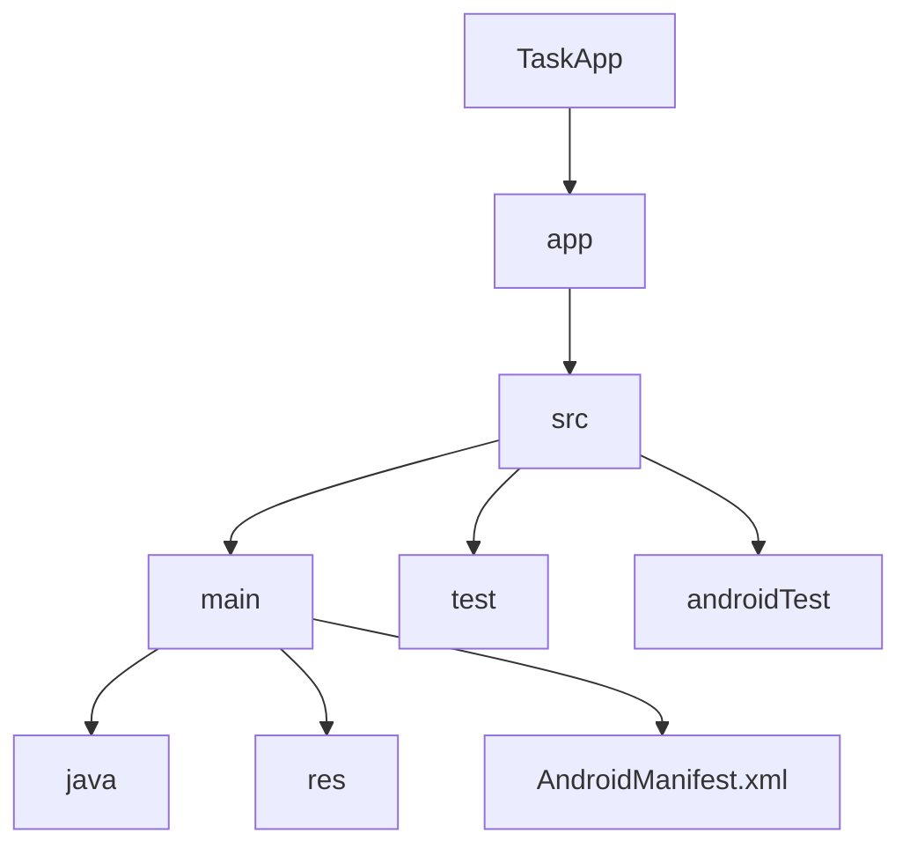

# 📱 TaskApp - Ваш персональный менеджер задач

[](https://developer.android.com)
[](https://kotlinlang.org)
[](https://gradle.org)

[](https://github.com/ReazonVan/TaskApp/stargazers)
[](https://github.com/ReazonVan/TaskApp/network)
[](https://github.com/ReazonVan/TaskApp/issues)

---

## 📋 О проекте

<div align="center">


</div>

TaskApp - это современное Android-приложение для эффективного управления задачами, разработанное с использованием последних технологий и лучших практик разработки. Приложение помогает пользователям организовывать свои задачи, отслеживать прогресс и повышать продуктивность.

### ✨ Основные возможности

<div align="center">

| 🚀 Функция | 📝 Описание |
|------------|-------------|
| 📝 Создание задач | Быстрое добавление и редактирование задач с поддержкой приоритетов |
| 🏷️ Категоризация | Гибкая система категорий и тегов для удобной организации |
| ⏰ Напоминания | Умные уведомления и напоминания о предстоящих задачах |
| 📊 Статистика | Подробная аналитика продуктивности с визуализацией данных |
| 🌙 Темная тема | Комфортная работа в любое время суток с автопереключением |
| 🔄 Синхронизация | Бесшовная синхронизация между всеми устройствами |
| 🔍 Поиск | Быстрый поиск по задачам с фильтрацией |
| 📅 Календарь | Интеграция с календарем для планирования |
| 🔒 Безопасность | Защита данных и конфиденциальность |

</div>

## 🚀 Технологический стек

<div align="center">

| 💻 Технология | 📝 Описание |
|---------------|-------------|
| Kotlin | Современный язык программирования с null-safety и корутинами |
| Gradle | Система сборки с поддержкой Kotlin DSL |
| MVVM | Архитектурный паттерн для чистого разделения логики |
| Room | Удобная и производительная база данных от Google |
| Material Design 3 | Современный адаптивный дизайн с поддержкой тем |
| Jetpack | Navigation, ViewModel, LiveData, DataBinding |
| Coroutines | Асинхронное программирование и многопоточность |
| Dagger Hilt | Внедрение зависимостей |
| WorkManager | Фоновые задачи и синхронизация |

</div>

## 🎯 Целевая аудитория

<div align="center">

| 👥 Группа | 📝 Описание |
|-----------|-------------|
| 👨‍💼 Профессионалы | Эффективная организация рабочих задач |
| 👩‍🎓 Студенты | Управление учебными задачами и дедлайнами |
| 👥 Команды | Совместная работа над проектами |
| 📱 Пользователи | Ценящие простоту и функциональность |

</div>

## ⚙️ Установка

### Системные требования

<div align="center">

| 📱 Требование | ⚙️ Минимум | 🚀 Рекомендуется |
|---------------|------------|------------------|
| Android | 6.0 (API 23) | 10.0 (API 29) |
| Память | 50 MB | 100 MB |
| Сервисы | Google Play | Google Play |

</div>

### Пошаговая установка

<div align="center">

```bash
# 1️⃣ Клонируйте репозиторий
git clone https://github.com/ReazonVan/TaskApp.git
cd TaskApp

# 2️⃣ Откройте проект в Android Studio (2022.1.1 или новее)

# 3️⃣ Синхронизируйте зависимости
./gradlew build

# 4️⃣ Запустите приложение на эмуляторе или устройстве
```

</div>

## 🔧 Разработка

### Структура проекта

<div align="center">



</div>

### Сборка и тестирование

<div align="center">

| 🛠️ Действие | 💻 Команда |
|-------------|------------|
| Debug сборка | `./gradlew assembleDebug` |
| Release сборка | `./gradlew assembleRelease` |
| Unit тесты | `./gradlew test` |
| Android тесты | `./gradlew connectedAndroidTest` |

</div>

## 🔜 Планы развития

<div align="center">

| 🚀 Функция | 📊 Статус |
|------------|-----------|
| Google Calendar | В разработке |
| Виджеты | Планируется |
| Экспорт/импорт | Планируется |
| Голосовой ввод | В планах |
| Умные списки | В планах |
| Статистика | В планах |
| Совместное использование | В планах |

</div>

## 📧 Контакты

<div align="center">

| 📱 Контакт | 🔗 Ссылка |
|------------|-----------|
| 📧 Email | [reazonvan206@gmail.com](mailto:reazonvan206@gmail.com) |
| 💬 Telegram | [@reazonvan](https://t.me/reazonvan) |
| 🌐 GitHub | [ReazonVan](https://github.com/ReazonVan) |

</div>

## 🤝 Поддержка проекта

<div align="center">

| ⭐ Действие | 📝 Описание |
|------------|-------------|
| Звезда | Поставьте звезду на GitHub |
| Issues | Сообщайте об ошибках |
| Идеи | Предлагайте улучшения |
| Шеринг | Делитесь проектом |

</div>

---

<div align="center">
  
# ⭐️ TaskApp - Управляйте задачами эффективно! ⭐️

</div> 